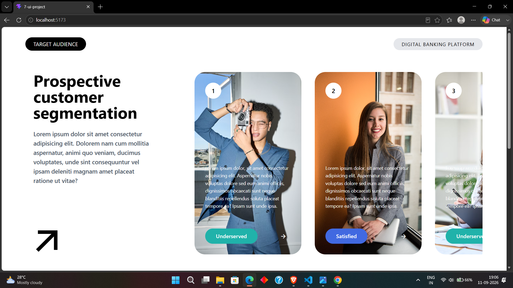
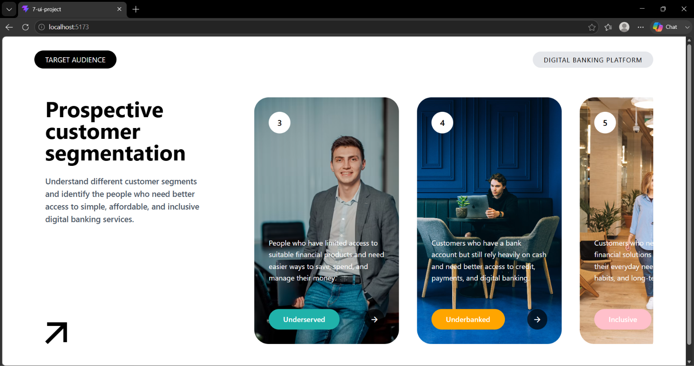
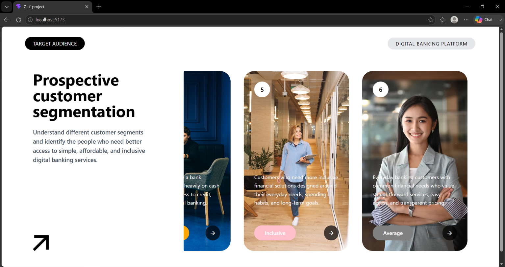

# Digital Banking Customer Segments UI

A modern and responsive **React + Vite UI project** designed to present different digital banking customer segments through an interactive card-based layout.

The project focuses on clean UI design, reusable React components, responsive structure, and Tailwind CSS styling.

## 🚀 Live Demo

🔗 Link:- https://digitalbankingcustomersegmentsui.vercel.app/

## 📸 Screenshot

o Screenshot 1:



o Screenshot 2:



o Screenshot 3:



## ✨ Features

- Modern digital banking landing page UI
- Customer-segment based card layout
- Six different customer profiles/segments
- Reusable React components
- Responsive layout
- Tailwind CSS styling
- Interactive card elements and arrow icons
- Clean and organized component structure
- Image-based visual cards
- Mobile-friendly design

## 🛠️ Tech Stack

- **React.js**
- **Vite**
- **Tailwind CSS**
- **JavaScript (ES6+)**
- **Lucide React**
- **Remix Icon**
- **HTML5**
- **CSS3**

## 📂 Project Structure

```text
Digital-Banking-Customer-Segments-UI/
├── public/
│   ├── Desktop-1.png
│   ├── Desktop-2.png
│   └── Desktop-3.png
├── src/
│   ├── assets/
│   │   ├── photo-1.avif
│   │   ├── photo-2.avif
│   │   ├── photo-3.avif
│   │   ├── photo-4.avif
│   │   ├── photo-5.avif
│   │   └── photo-6.avif
│   │
│   ├── components/
│   │   └── Section1/
│   │       ├── Arrow.jsx
│   │       ├── HeroText.jsx
│   │       ├── LeftContent.jsx
│   │       ├── Navbar.jsx
│   │       ├── Page1Content.jsx
│   │       ├── RightCard.jsx
│   │       ├── RightCardContent.jsx
│   │       ├── RightContent.jsx
│   │       └── Section1.jsx
│   │
│   ├── App.jsx
│   ├── index.css
│   └── main.jsx
│
├── package.json
└── README.md
```

## 🎯 Customer Segments

The UI presents different banking customer segments, including:

- **Underserved** – Customers looking for simple and affordable banking services.
- **Satisfied** – Customers who value convenience, reliability, and personalized services.
- **Underbanked** – Customers who still rely heavily on cash and need better access to digital banking.
- **Inclusive** – Customers looking for financial solutions designed around their everyday needs.
- **Average** – Everyday banking customers who prefer straightforward and transparent services.


## 📚 What I Practiced

- React functional components
- Passing data through props
- Rendering dynamic UI using arrays
- Component reusability
- `map()` for rendering multiple cards
- Tailwind CSS utility classes
- Responsive UI structure
- Organizing a React project into reusable components
- Using image assets inside React
- Using icon libraries in a React project

## 👨‍💻 Author

**Manoj Madke**

CSE (AI & ML) Graduate | Python Full Stack Developer

- GitHub: https://github.com/ManojMadke
- LinkedIn: https://www.linkedin.com/in/manoj-madke

## 📄 License

This project is created for learning and portfolio purposes.
